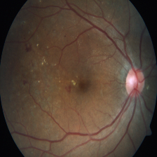

# Diabetic Retinopathy Classification

Diabetic Retinopathy (DR) is a diabetes complication that affects the eyes and can cause blindness if not diagnosed and treated early. It is characterized by damage to the blood vessels of the retina, leading to different severity levels of the disease.

  
  
  
  

## DR Classification

The disease is typically classified into five categories based on severity:

- **No DR**: No signs of diabetic retinopathy.
- **Mild**: Presence of microaneurysms only.
- **Moderate**: More than just microaneurysms but less than severe signs.
- **Severe**: Extensive hemorrhages and other abnormalities.
- **Proliferated**: Advanced stage with new blood vessel growth (neovascularization).

---

## Dataset Overview

We use three datasets for training and evaluation, each with different characteristics and sizes:

### 1. Resized 2015 & 2019 Diabetic Retinopathy Detection

- Contains images from the 2015 Diabetic Retinopathy Detection and APTOS 2019 Blindness Detection competitions.  
- The dataset is resized for uniformity to facilitate training.  
- Available here: [Resized 2015-2019 Diabetic Retinopathy Detection](https://www.kaggle.com/datasets/c7934597/resized-2015-2019-diabetic-retinopathy-detection)

---

### 2. Indian Diabetic Retinopathy Image Dataset (IDRiD)

- Contains 516 original color fundus images (JPG).  
- Split into training set (413 images) and test set (103 images).  
- Provides ground truth labels for Diabetic Retinopathy and Diabetic Macular Edema severity grades in CSV format.  
- Available here: [IDRiD Dataset](https://ieee-dataport.org/open-access/indian-diabetic-retinopathy-image-dataset-idrid)

---

### 3. APTOS-2019 Blindness Detection (APTOS 2019 BD)

- Contains 3662 samples collected from participants in rural India.  
- Organized by the Aravind Eye Hospital, India.  
- Provides labeled retinal images for DR severity classification.  
- Available here: [APTOS 2019 Dataset](https://www.kaggle.com/datasets/mariaherrerot/aptos2019)

---

### Dataset Folder Structure

Each dataset is organized into folders representing the 5 DR classes:

'''
dataset/
└── datasetname/
    ├── no_dr/          # Images with no diabetic retinopathy
    ├── mild/           # Images with mild diabetic retinopathy
    ├── moderate/       # Images with moderate diabetic retinopathy
    ├── severe/         # Images with severe diabetic retinopathy
    └── proliferated/   # Images with proliferated diabetic retinopathy
'''
